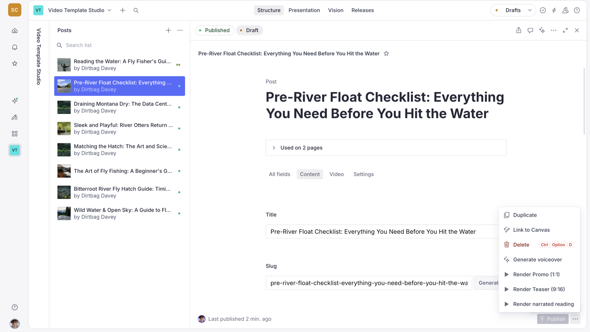
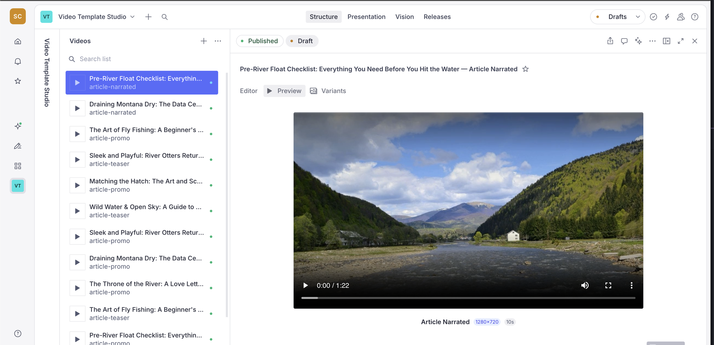
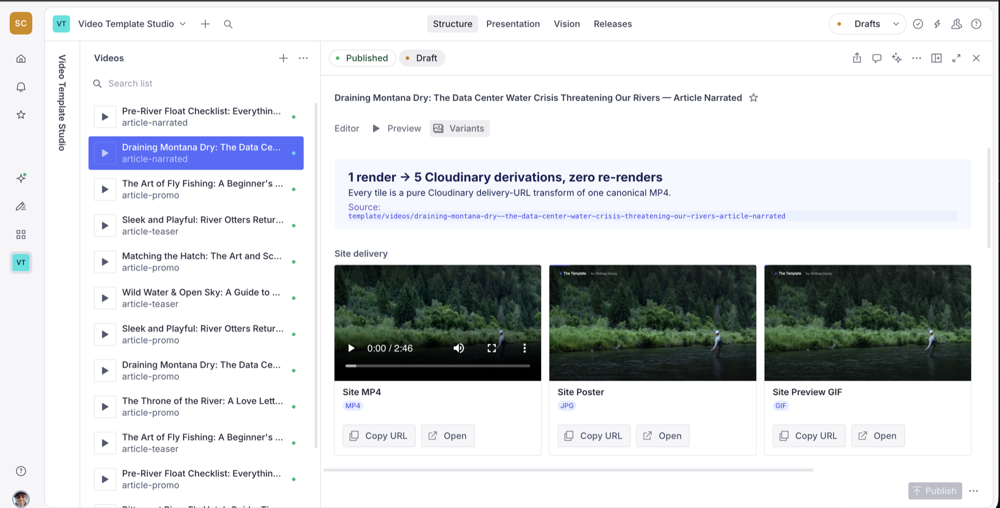

# Sanity + Remotion + Cloudinary video template

Render videos from your **Sanity** content with **Remotion**, then publish them to a **Next.js** site through **Cloudinary** — triggered with one click from the CMS.

Write a post in Sanity Studio, hit **Publish**, and a few moments later an MP4 is rendered — **locally with headless Chromium, or in a Vercel Sandbox once deployed** — uploaded to Cloudinary, and playing on your site. The local path means you can clone, configure only **Sanity + Cloudinary**, and render a video with **no Vercel account at all**.

On top of that core loop the template ships the full showcase: **Sanity Assist** AI copy generation backed by an editable brand-voice doc, and automatic **Cloudinary variants** — five derivatives of the one canonical render (site MP4, poster JPG, preview GIF, YouTube 1080p, podcast MP3) generated at render time, never re-rendered. The Cloudinary integration is surfaced inside the Studio as a **Preview** view (a plain player of the canonical render) and a **Variants** view on each `video` document (gallery + live transform preview). The minimal core (Studio document action → render → playback) still works on its own if you don't want the extras.



> [!IMPORTANT]
> **How auth is handled:** the Studio's render and newsletter actions send the logged-in editor's own Sanity session token, which the API routes validate server-side as a write-capable project member. No secrets are bundled into the Studio, and the write-capable `SANITY_API_WRITE_TOKEN` never leaves the server.

## What's included

On top of the core render loop, the template ships four fanout surfaces, all driven by the one canonical render:

1. **Site — render once.** Publish (or a Studio render action) → render → Cloudinary → site playback (promo + teaser compositions; site MP4, poster, and preview-GIF variants).
2. **Newsletter — fan out to email.** A Resend-backed `newsletter` doc that embeds the `site-preview-gif` variant as the email hero.
3. **Transactional email.** The signup welcome email embeds the preview GIF of a chosen render — same variant, different send path.
4. **Narrated — long-form TTS.** The `article-narrated` composition: ElevenLabs voiceover, computed duration, the long-form variants (YouTube 1080p, podcast MP3), and a podcast RSS feed (`/feed.xml`) built from the MP3s.

## How it works

```
Sanity Studio (post)
   │  hit Publish (auto-promo) — or click "Render Promo / Teaser" (document action)
   ▼
POST /api/video/render  (Next.js route, bearer-authed)
   │  1. create a `video` doc  → status: rendering
   │  2. spawn a Vercel Sandbox (restored from a build-time snapshot in prod)
   │     and renderMediaOnVercel inside it
   │  3. uploadToVercelBlob → public URL → upload to Cloudinary → delete Blob copy
   │       → status: uploading
   │  4. patch the doc with cloudinaryUrl  → status: ready
   ▼
Next.js site
   reads `video` docs where status == "ready" and plays them from the Cloudinary URL
```

The render runs synchronously, so the route returns the finished `cloudinaryUrl` in its response — the Studio keeps reading `status: ready` straight from it. Full pipeline detail (auth, idempotency, the soft timeout, both render backends) lives in [docs/architecture.md](./docs/architecture.md).

> **Local render fallback.** Step 2 above describes the Vercel Sandbox, which the deployed app always uses. Run locally with no `BLOB_READ_WRITE_TOKEN` (or with `LOCAL_RENDER=true`) and the route instead renders with **headless Chromium on your machine** and uploads straight to Cloudinary — same `video` doc lifecycle, no Vercel needed. See [docs/plans-and-costs.md → Vercel](./docs/plans-and-costs.md#vercel--only-for-the-hosted-deployment).

## Monorepo layout

pnpm workspaces, orchestrated with [Turborepo](https://turbo.build/) (`turbo.json`) —
`pnpm dev` runs both apps at once, and `build`/`lint`/`typegen` are cached.

```
apps/web/            @template/web        — Next.js 16 site + /api/video/render (spawns a Vercel Sandbox) + Remotion site entry
apps/studio/         @template/studio     — Sanity Studio v5: schemas, "Render" actions, Assist + brand voice
packages/video-core/ @template/video-core — Remotion compositions, registry, Cloudinary variant catalog
```

One invariant to know before editing: server code and the Studio import only `@template/video-core/registry` (pure metadata, no React) — only the Remotion bundle imports the barrel. See [docs/architecture.md → the registry boundary](./docs/architecture.md#the-react-free-registry-boundary).

## Documentation

Deeper guides live in [`docs/`](./docs/):

- [Architecture](./docs/architecture.md) — pipeline, registry boundary, variant system
- [Configuration](./docs/configuration.md) — env prefixes, full env reference, auth, the Sanity token
- [Vercel Sandbox](./docs/vercel-sandbox.md) — connecting a Blob store, the build-time snapshot, local dev
- [The apps](./docs/apps.md) — the site + render route, and the Studio's render/preview/variants surfaces
- [Assist + brand voice](./docs/assist.md) — AI field actions and the brand-voice doc
- [Plans & costs](./docs/plans-and-costs.md) — what every service costs, and the Vercel Pro requirement
- [Troubleshooting](./docs/troubleshooting.md) — the common gotchas, with fixes

## Prerequisites

- Node 20+
- pnpm 10+
- A [Sanity](https://www.sanity.io/) project + dataset, and an **Editor** API token (write access)
- A [Cloudinary](https://cloudinary.com/) account (cloud name + API key/secret)
- **(Only to deploy the hosted app)** A [Vercel](https://vercel.com/) account — host `apps/web` and connect a [Blob store](https://vercel.com/docs/storage/vercel-blob) for the sandbox renderer. **Not needed to run locally**, where renders fall back to headless Chromium on your machine. See [docs/vercel-sandbox.md](./docs/vercel-sandbox.md)

## Getting Started

Follow these steps to get the template running locally. (See [Prerequisites](#prerequisites) above for the accounts and tooling you'll need first.)

**1. Install dependencies and create your env files**

```bash
pnpm install

cp apps/web/.env.local.example apps/web/.env.local
cp apps/studio/.env.example apps/studio/.env
```

**2. Fill in the env files**

**`apps/web/.env.local`**

| Var | What |
| --- | --- |
| `NEXT_PUBLIC_SANITY_PROJECT_ID` | Sanity project id |
| `NEXT_PUBLIC_SANITY_DATASET` | dataset (e.g. `production`) |
| `SANITY_API_WRITE_TOKEN` | Editor+ token — the render route creates/updates `video` docs |
| `VIDEO_RENDER_SECRET` | *Optional.* Server-side fallback bearer for CI/automation. The Studio's "Render" action does **not** use it — it authenticates with the editor's own Sanity session |
| `CLOUDINARY_CLOUD_NAME` / `CLOUDINARY_API_KEY` / `CLOUDINARY_API_SECRET` | Cloudinary credentials |
| `NEXT_PUBLIC_SITE_URL` | public origin, e.g. `https://renderonce.dev` (falls back to `http://localhost:3000`) — drives OG tags, sitemap, RSS |
| `BLOB_READ_WRITE_TOKEN` | *Optional locally.* Leave empty to render with headless Chromium on your machine (uploads straight to Cloudinary — no Vercel needed). Set it to use the Vercel Sandbox instead: auto-injected on Vercel, or `cd apps/web && vercel link && vercel env pull` for local dev. See [docs/vercel-sandbox.md](./docs/vercel-sandbox.md). |

> This is the minimum to render. The full env reference — Resend (newsletter), ElevenLabs (narration), visual editing, `LOCAL_RENDER` — is in [docs/configuration.md](./docs/configuration.md).

**`apps/studio/.env`**

| Var | What |
| --- | --- |
| `SANITY_STUDIO_PROJECT_ID` / `SANITY_STUDIO_DATASET` | same project/dataset as the web app |
| `SANITY_STUDIO_RENDER_API_URL` | `http://localhost:3000/api/video/render` locally; `https://renderonce.dev/api/video/render` in production |
| `SANITY_STUDIO_ENABLE_NARRATED` | optional; `true` enables the paid ElevenLabs-backed narrated composition (default off) |

> **Two features lean on paid third-party plans** — Sanity Assist (Growth plan) and narrated video (ElevenLabs) — both degrade gracefully on free tiers. See [docs/configuration.md → Optional / paid features](./docs/configuration.md#optional--paid-features) and [docs/plans-and-costs.md](./docs/plans-and-costs.md) for the full cost picture.

**3. Run the apps**

```bash
pnpm dev            # both apps at once (Turborepo) — site :3000 + studio :3333
```

Or run them individually: `pnpm dev:web` (http://localhost:3000) and
`pnpm dev:studio` (http://localhost:3333).

**Rendering works locally with no Vercel account.** With `BLOB_READ_WRITE_TOKEN` left empty, the render route renders each composition with headless Chromium on your machine and uploads straight to Cloudinary — Chromium downloads once on the first render (~1 min, one-time). To render in a **Vercel Sandbox** instead — the path the deployed app always uses — connect a Blob store and pull the token locally: see [docs/vercel-sandbox.md](./docs/vercel-sandbox.md).

**4. Render your first video**

1. In Studio, create an **Author**, then a **Post** (title, slug, author, excerpt, main image, body). In the post's **Video** group, enable **Auto-generate promo on publish**.
2. Hit **Publish** — a promo (1:1) render fires automatically in the background. (You can also trigger renders anytime from the document action menu → **Render Promo (1:1)** or **Render Teaser (9:16)**.)
3. Watch the **Videos** list: the new doc moves `rendering → uploading → ready`.
4. Visit `http://localhost:3000/posts/<slug>` — the video plays from Cloudinary. `/videos` lists every rendered video.

## Studio views, Assist & Cloudinary variants

- **Cloudinary in the Studio.** Each `video` document gains a **Preview** view (a player of the canonical render) and a **Variants** view (a gallery of the Cloudinary derivatives plus a live transform preview) — all from public delivery URLs, no secret in the Studio. See [docs/apps.md](./docs/apps.md).

  
- **Sanity Assist + brand voice.** "Brand AI" field actions — rewrite text or generate video copy in an editable brand voice — backed by **Brand Voices** docs in the Studio. Needs a Growth plan (Agent Actions); seeding and customization in [docs/assist.md](./docs/assist.md).
- **Cloudinary variants.** Each composition opts into a variant set (site MP4/poster/preview-GIF, plus YouTube 1080p and podcast MP3 for the narrated composition) in `packages/video-core/src/registry.ts` — eager-generated at render time and stored on `video.variants[]`, never re-rendered. See [docs/architecture.md → variant system](./docs/architecture.md#the-cloudinary-variant-system).

  
- **Transform playground.** The site ships a `/playground` page — an interactive Cloudinary transform explorer that demonstrates the same variant system live, independent of any rendered video. Tweak transforms and watch the delivery URL change.

## Deploy

Deploy `apps/web` to Vercel with the project root set to `apps/web` (the included `vercel.json` installs and builds from the monorepo root, including the build-time sandbox snapshot). In the Vercel dashboard, **Storage → Create → Blob** and attach the store to the project — `BLOB_READ_WRITE_TOKEN` is then auto-injected at runtime. Set the Function max duration to **800s** for `/api/video/render`, and add all `apps/web` env vars (Sanity, Cloudinary). Point `SANITY_STUDIO_RENDER_API_URL` at the deployed URL. Deploy the Studio with `pnpm deploy:studio`.

## Customizing

- **Add a composition:** create `packages/video-core/src/compositions/Foo.tsx`, register it in `COMPOSITIONS` (`registry.ts`) and `COMPOSITION_COMPONENTS` (`registry-components.ts`), export it from `index.ts`, then add a render action (or extend the existing ones) in `apps/studio/src/actions/renderVideo.tsx`. Locally, restart `pnpm dev:web` so the next render rebundles. On Vercel, redeploy — the build-time snapshot refreshes automatically.
- **Change the look:** edit the palette in `packages/video-core/src/types.ts` (`COLORS`). Per-composition style constants (shadows, sizing) live inline in each composition file (e.g. `SHADOW` in `compositions/ArticlePromo.tsx`).
- **Change the source content:** the compositions render from `ArticleVideoProps` (`types.ts`). Adjust that schema, the `post` schema, and the field mapping in the Studio render action together.

---
